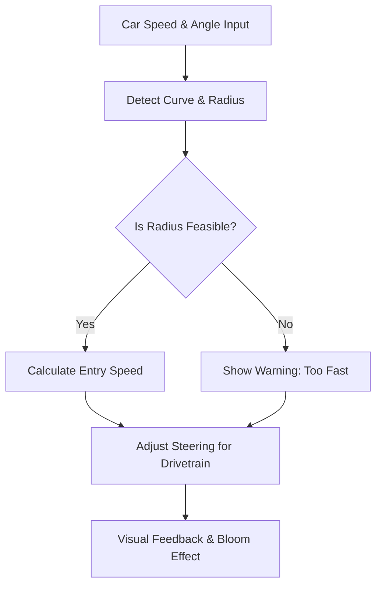

# 🚗 DRIVEWISE Simulation — Rear or Front Wheel Drive Analyzer

[](LICENSE)
[](https://github.com/mach2furkan/rear-or-front-wheel/issues)
[](https://github.com/mach2furkan/rear-or-front-wheel)

Welcome to **Drivewise Simulation**, an interactive tool that visualizes how a sports car behaves in a curve depending on its drivetrain (Rear-Wheel Drive or Front-Wheel Drive).  
This project combines **physics-based calculations** with **stunning 3D visuals** using React Three Fiber and custom post-processing effects.

---

## 🚀 Live Demo

Coming soon...

---

## 📸 Preview

  
<!-- Replace this with actual media when ready -->

---

## 📦 Project Structure

```
drivewise_simulation/
├── public/
├── src/
│   ├── components/
│   ├── scenes/
│   ├── hooks/
│   └── car-simulation.tsx  ← Post-processing fix applied here
├── package.json
└── README.md
```

---

## 🧰 Tech Stack

- ⚛️ React + TypeScript
- 🎮 Three.js with `@react-three/fiber`
- 💡 Visual Effects via `@react-three/postprocessing`
- 🧠 Real-time physics logic and drift control
- 📈 Custom curve detection and speed-angle estimation

---

## 🛠 Fix: MotionBlur Import Error

### ❌ Problem  
`MotionBlur` was causing an import error from `@react-three/postprocessing`.

### ✅ Solution  
We removed `MotionBlur` and kept the supported `Bloom` effect for smooth visual enhancements.

```tsx
import { EffectComposer, Bloom } from '@react-three/postprocessing'

<EffectComposer>
  <Bloom intensity={1.5} luminanceThreshold={0.3} />
</EffectComposer>
```

---

## 🎮 Features

- 🔄 Toggle between Front-Wheel and Rear-Wheel Drive
- 📉 Real-time curve entry speed, angle, and radius calculations
- 💥 Bloom effect feedback for driving precision
- 📊 Physics engine: mass, friction, acceleration behavior
- 🚨 Error & oversteer/understeer detection alerts

---

## 📐 Curve Entry Physics – Explained Visually & Mathematically

Understanding how a car behaves while entering a curve depends on **centripetal force**, **friction**, **mass**, **velocity**, and **drivetrain type**.

### 🧮 Required Turning Radius Formula

\[
R = \frac{v^2}{g \cdot \mu}
\]

**Where:**

- \( R \) → Minimum turning radius (meters)  
- \( v \) → Vehicle speed (m/s)  
- \( g \) → Gravitational acceleration (9.81 m/s²)  
- \( \mu \) → Tire friction coefficient (0.7 - 1.2)

---

### 🧠 Bonus Insight – Slip Angle

To simulate skidding or drifting:

\[
\alpha = \tan^{-1} \left(\frac{v_{lat}}{v_{long}}\right)
\]

Where:
- \( \alpha \) is the **slip angle**
- \( v_{lat} \) = lateral velocity
- \( v_{long} \) = longitudinal velocity

---

### 🌀 Simulation Logic Flow



---

## 🗺️ Feature Roadmap

| Feature | Status |
|--------|--------|
| Curve detection using camera input | 🔜 Planned |
| Driver profile adaptation with AI | ⏳ In Progress |
| Advanced HUD visualization | ✅ Completed |
| Audio warnings & alerts | 🔜 Planned |
| Exporting lap data to CSV | ⏳ In Progress |

---

## 🧪 Testing

```bash
# Run type-checks
npm run typecheck

# Run the simulation in dev mode
npm run dev

# Run automated unit tests (TBD)
npm run test
```

---

## 🤝 Acknowledgments

- 🛠 [@pmndrs](https://github.com/pmndrs) for their awesome React + Three.js ecosystem
- 📚 Simulation logic inspired by motorsport & drift telemetry
- 👨‍💻 Big thanks to contributors who tested and optimized the performance

---

## 🧑‍💻 Contributing

Contributions are welcome! Open an issue or PR — or fork and tinker freely.

```bash
git clone https://github.com/mach2furkan/rear-or-front-wheel
cd rear-or-front-wheel
npm install
npm run dev
```

---

## 📄 License

This project is licensed under the MIT License.  
See [LICENSE](./LICENSE) for full terms.

